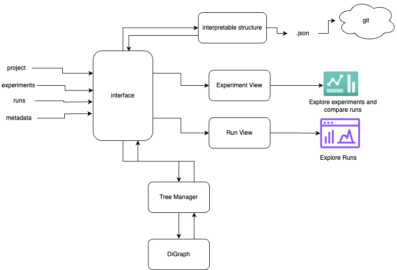
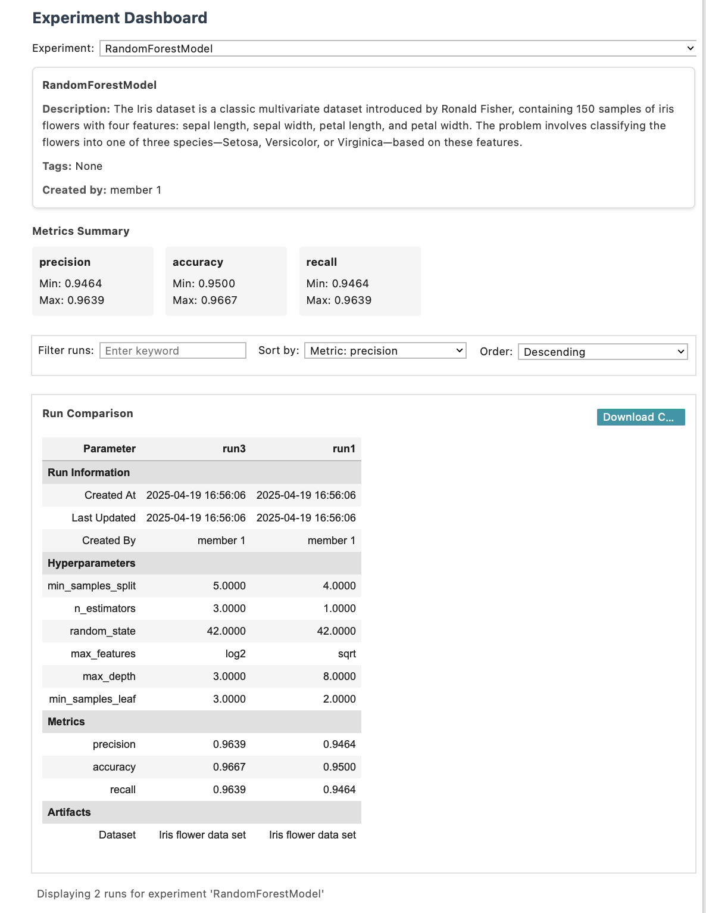
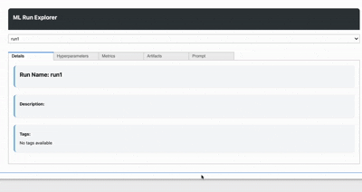
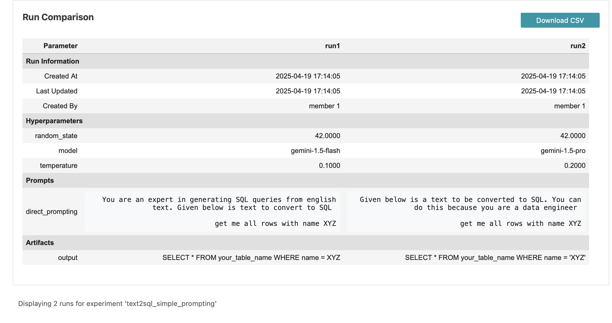

```
ooooooooooooooooooooooooooooooooooooooooooooooooooooooooooooooooooooooooooooooooooooooooooooooooooooooooooooooooooooooo
ooooooooooooooooooooooooooooooooooooooooooooooooooooooooooooooooooooooooooooooooooooooooooooooooooooooooooooooooooooooo
ooo   o        o        o ooooooooooooooooooooooooooooooooooooooooooooooooooooooooooooooooooooooooooooooooooooooooooooo
ooooo  \      / \      / oooooooooooooooooooooooooooooooooooooooooooooooooooooooooooooooooooooooooooooooooooooooooooooo
ooooo   o    o   o    o ooooooooooooooooooooooooooooooooooooooooooooooooooooooooooooooooooooooooooooooooooooooooooooooo
oooooo   \  /     \  / oooooooooooooooooooooooooooooooooooooooooooooooooooooooooooooooooooooooooooooooooooooooooooooooo
ooooooo   o       o   ooooooooooooooooooooooooooooooooooooooooooooooooooooooooooooooooooooooooooooooooooooooooooooooooo
ooooooooo  \     /   oooooooooooooooooooooooooooooooooooooooooooooooooooooooooooooooooooooooooooooooooooooooooooooooooo
oooooooooo  \   /   ooooooooooo  ███████╗██╗  ██╗██████╗      ████████╗██████╗ ███████╗███████╗  oooooooooooooooooooooo
ooooooooooo  \ /   oooooooooooo  ██╔════╝╚██╗██╔╝██╔══██╗     ╚══██╔══╝██╔══██╗██╔════╝██╔════╝  oooooooooooooooooooooo
oooooooooooo  o  oooooooooooooo  ███████╗ ╚███╔╝ ██████╔╝        ██║   ██████╔╝███████╗███████╗  oooooooooooooooooooooo
oooooooooooo  |  oooooooooooooo  ██╔════╝ ██╔██╗ ██╔═══╝         ██║   ██╔══██╗██║╚════██║       oooooooooooooooooooooo                 
oooooooooooo  |  oooooooooooooo  ███████╗██╔╝ ██╗██║             ██║   ██║  ██║███████║███████║  oooooooooooooooooooooo                  
oooooooooooo  |  oooooooooooooo  ╚══════╝╚═╝  ╚═╝╚═╝             ╚═╝   ╚═╝  ╚═╝╚══════╝╚══════╝  oooooooooooooooooooooo     
oooooooooooo  |  oooooooooooooooooooooooooooooooooooooooooooooooooooooooooooooooooooooooooooooooooooooooooooooooooooooo
oooooooooooo  o  oooooooooooooooooooooooooooooooooooooooooooooooooooooooooooooooooooooooooooooooooooooooooooooooooooooo
ooooooooooooooooooooooooooooooooooooooooooooooooooooooooooooooooooooooooooooooooooooooooooooooooooooooooooooooooooooooo
ooooooooooooooooooooooooooooooooooooooooooooooooooooooooooooooooooooooooooooooooooooooooooooooooooooooooooooooooooooooo
ooooooooooooooooooooooooooooooooooooooooooooooooooooooooooooooooooooooooooooooooooooooooooooooooooooooooooooooooooooooo
ooooooooooooooooooooooooooooooooooooooooooooooooooooooooooooooooooooooooooooooooooooooooooooooooooooooooooooooooooooooo
ooooooooooooooooooooooooooooooooooooooooooooooooooooooooooooooooooooooooooooooooooooooooooooooooooooooooooooooooooooooo
ooooooooooooooooooooooooooooooooooooooooooooooooooooooooooooooooooooooooooooooooooooooooooooooooooooooooooooooooooooooo
```

## Overview

Data scientists and machine learning engineers often face challenges such as disorganized experiment logs, lost hyperparameter configurations, scattered results, and no easy way to compare or reproduce past runs. ExpTree addresses these issues by providing a lightweight solution for tracking machine learning experiments. It enables users to log hyperparameters, metrics, and artifacts in a structured manner, making it easier to manage experiments and analyze results. Designed with simplicity in mind, this module requires no database, web interface, or server setup, making it highly portable and easy to integrate into any environment — <i>No strings attached</i>.

## Architecture/Solution



The framework is designed to track experiments through a hierarchical structure:

1.  **Projects:** The top-level container for related experiments.
2.  **Experiments:** Specific instances of a model or approach being tested.
3.  **Runs:** Individual executions of an experiment with unique hyperparameters and results.

Key Features:

* **Experiment Creation:** Easily define new experiments with descriptive names.
* **Run Tracking:** Record hyperparameters, metrics (e.g., accuracy, loss), artifacts (e.g., model files, plots), prompts
* **Hyperparameter Logging:** Track the specific configurations used in each run.
* **Metric Logging:** Store evaluation results for each run.
* **Artifact Logging:** Log relevant files and visualizations associated with each run.
* **Experiment Comparison:** Analyze and compare the results of different runs.
* **Git Integration:** Export experiment metadata to a file(JSON) that can be tracked with Git for version control.
* **Resume:** Load previously saved experiment metadata to continue work.
* **External Links:** Add links to external resources like TensorBoard for detailed analysis(included in artifacts).
* **Image Artifacts:** Log images to visualize training curves, ROC curves, and other relevant plots(included in artifacts).
* **CSV Download:** Download experiment metadata as csv file from experiment view

## Quick Start

1.  **Installation:** 
    ```bash
    pip install exptree
    ```

2.  **Import the Library:**
    ```python
    from exptree.src import tree
    ```

3. Check example notebooks on `how to use`

## Usage

### API Overview

* **`set_project()`:** creates/set the project.
* **`set_experiment(project_name)`:** creates/set the experiment.
* **`start_run()`:** Starts a new run within the current experiment.
* **`log_hyperparameters()`:** Logs/updates hyperparameters for the current run.
* **`log_metrics()`:** Logs/updates metrics for the current run.
* **`log_artifact()`:** Logs/updates an artifact for the current run.
* **`log_prompts()`:** Logs/updates prompt for the current run.
* **`stop_run()`:** Ends the current run.
* **`view_experiments()`:** Displays experiments and runs, compare runs of same experiments
* **`view_runs()`:** Displays runs and its tracked info
* **`export_tree(filename)`:** Exports experiment metadata to a JSON file.
* **`load_tree(filename)`:** Loads experiment metadata from a JSON file.
* **`view_tree()`:** View project, experiment, runs ID's and name.
* **`delete(name, type)`:** removes a node from tree

### Starter Notebooks

* [Experiment Tracking.ipynb](Experiment%20Tracking.ipynb)
* [Prompt Tracking.ipynb](Prompt%20Tracking.ipynb)

## 🧭  User Journey: Experiment Tracking
1. Setup Phase

Set Project → Create or select a project.<br>
Set Experiment → Define an experiment within the project.<br>
2. Execution Phase

Start Run → Begin recording data for the run.<br>
Log Metadata → Log parameters, metrics, artifacts, prompts, etc.<br>
3. Exploration Phase

Use Notebook Dashboard → View and explore logged metadata.
4. Export & Track Phase

Export Tree → Save it as .json <br>
Track with Git → Commit/exported .json to version control.
5. Reload & Resume Phase

Reload JSON → Load the previous metadata file.<br>
Resume/Add More Experiments → Add more runs or experiments.

## Demo

### Experiment tracking



### Run Dashboard



### Prompt tracking



## Credits

Some parts of this module are generated using Claude.ai, chatgpt, gemini, perplexity using task oriented prompts


